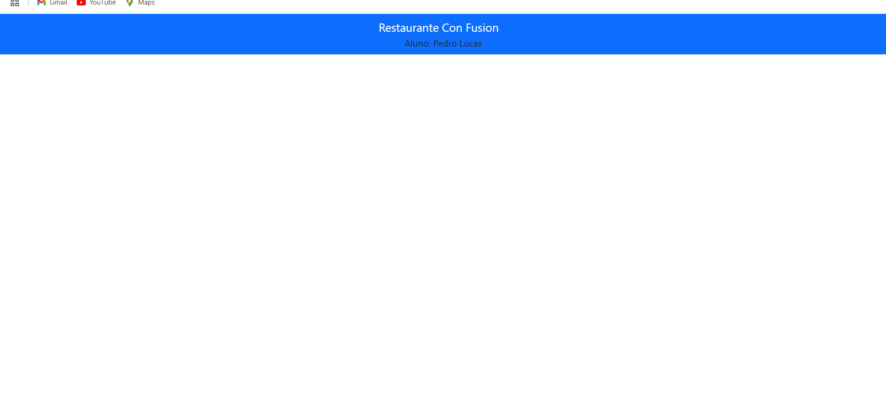

# Documentação da aula 07- 

## Informações Gerais
- **Data de Execução**: 21/11/2024
- **Aluno**: Pedro Lucas
# Configuração do Projeto com Reactstrap

## Passos Realizados

### 1. Configuração do React para usar o Reactstrap

Primeiro, configurei o projeto React para usar o Reactstrap, executando os seguintes comandos no terminal para instalar as dependências necessárias:

```bash
npm install reactstrap react react-dom
npm install --save bootstrap
npm install react-popper @popperjs/core
```

### 2. Configuração do Bootstrap
Em seguida, configurei o Bootstrap, adicionando a seguinte linha no arquivo src/index.js para importar o CSS do Bootstrap:

import 'bootstrap/dist/css/bootstrap.min.css';

### 3. Criação da Barra de Navegação
Para adicionar a barra de navegação, segui os seguintes passos:

Abri o arquivo src/App.js.
Apaguei o conteúdo entre as tags <header> e </header>.
Adicionei o seguinte código no lugar do conteúdo apagado:

<Navbar dark color="primary">
  <div className="container">
    <NavbarBrand href="/">Ristorante Con Fusion</NavbarBrand>
    <div>Aluno: Fulano de Tal</div>
  </div>
</Navbar>

### Explicação do código React com Reactstrap

#### `<Navbar>`:
- O componente `<Navbar>` é parte do Reactstrap e representa uma barra de navegação (menu).
- O `dark` aplica um estilo de texto claro, que normalmente é usado em barras de navegação escuras (em contraste com um fundo escuro).
- O `color="primary"` define a cor da barra de navegação. O valor `"primary"` refere-se à cor principal do tema Bootstrap (geralmente um tom de azul).

#### `<div className="container">`:
- Dentro da barra de navegação, há uma `<div>` com a classe `container`, que é uma classe do Bootstrap que cria um contêiner responsivo. Ela centraliza e limita a largura dos elementos dentro dela, de modo que a navegação fique organizada e ajustada em diferentes tamanhos de tela.

#### `<NavbarBrand href="/">`:
- O `<NavbarBrand>` é um componente do Reactstrap que representa o título ou a marca da barra de navegação.
- O `href="/"` indica que a marcação da barra de navegação será clicável e, ao ser clicada, o usuário será redirecionado para a raiz do site (`/`), ou seja, a página inicial.
- O texto `"Ristorante Con Fusion"` é o nome ou título da aplicação, que provavelmente representa o nome de um restaurante fictício, no contexto de um site de demonstração de um aplicativo de comida.

#### `<div>Aluno: Fulano de Tal</div>`:
- Este `<div>` exibe o nome do aluno, no caso `"Fulano de Tal"`. Isso pode ser usado para mostrar informações sobre quem está desenvolvendo ou sendo responsável pelo projeto, útil para demonstrações ou entregas de tarefas.


### 4. Alteração do Nome
Por fim, alterei o nome dentro da <div> de "Aluno: Fulano de Tal" para "Aluno: Pedro Lucas". O código ficou da seguinte forma:

<Navbar dark color="primary">
  <div className="container">
    <NavbarBrand href="/">Ristorante Con Fusion</NavbarBrand>
    <div>Aluno: Pedro Lucas</div>
  </div>
</Navbar>

1. <Navbar dark color="primary">:
<Navbar>: Esse é um componente da biblioteca Reactstrap. Ele representa uma barra de navegação (navbar), que é um elemento comum em sites para fornecer links para diferentes partes da aplicação.

dark: A propriedade dark altera o estilo da navbar para ter um fundo escuro. Esse estilo é usado quando você quer que o texto e os elementos dentro da navbar sejam mais claros para melhorar a visibilidade em contraste com um fundo escuro.

color="primary": Define a cor da navbar, usando a classe primary do Bootstrap. A cor "primária" geralmente é uma cor de destaque do tema (por padrão, é um tom de azul). O Bootstrap aplica essa cor ao fundo da navbar.

2. <div className="container">:
A classe container do Bootstrap é usada para centralizar e ajustar o conteúdo dentro de um espaço com largura fixa, de forma responsiva. Isso significa que a navbar não vai ocupar a largura inteira da tela, mas sim uma parte dela (com base no tamanho da tela do dispositivo). A container ajuda a garantir que o conteúdo dentro dela seja bem distribuído, com margens automáticas nas laterais.

<div className="container"> é uma maneira de organizar os elementos da navbar de forma que eles fiquem bem alinhados, sem se espalharem por toda a largura da tela.

3. <NavbarBrand href="/">:
<NavbarBrand>: Esse é um componente do Reactstrap que é utilizado para mostrar o nome ou marca da aplicação na navbar. Geralmente, ele é usado para exibir o logo ou o título do site ou da aplicação.

href="/": A propriedade href="/" define que o nome da marca, "Ristorante Con Fusion", será um link que, ao ser clicado, redireciona o usuário para a página inicial do site. O valor / significa que o link levará à raiz da aplicação, ou seja, à página inicial.

"Ristorante Con Fusion": Este é o texto que aparece na navbar e é o nome ou marca do site ou aplicativo. Nesse caso, é um nome fictício de um restaurante, possivelmente usado como exemplo de um projeto.

4. <div>Aluno: Pedro Lucas</div>:
Este é um simples <div> contendo o texto "Aluno: Pedro Lucas". Esse texto pode ser usado para mostrar quem é o responsável pelo projeto ou quem está desenvolvendo o código.

Função do texto: "Aluno: Pedro Lucas" pode ser útil em contextos como tarefas acadêmicas ou projetos de demonstração, onde é importante identificar quem criou o código. Pode ser exibido ao lado ou abaixo do nome da marca na navbar, dependendo do layout.

abre o arquivo README e atualizei com um resumo dos passos que foram feitos na atividade de hoje.

insire uma imagem mostrando o navbar com o seu nome como a imagem a seguir:





